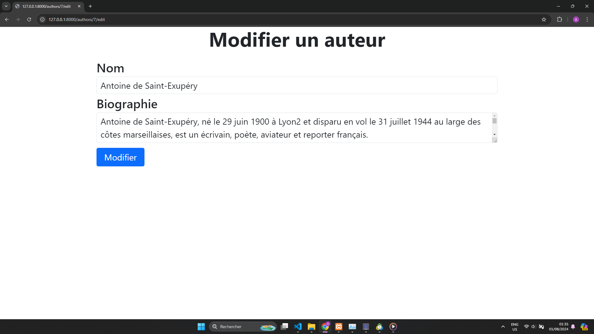

TP-1 Gestion d'une bibliotheque 

### Acceuil 

### Views Livres  

Page Liste des Livres (index.blade)

Page Liste des Livres suite (index.blade)

Page Ajout de livre (create)

Page Modification  de livre (edit)

Page Details de livre (show)

Page Suppression de livre (on remarque si on s'attarde sur la page Liste de livre suite que le livre "Hosties Noires" a été supprimé)

### Views Auteurs

Page Liste des Auteurs (index.blade)

Page Liste des Auteurs suite (index.blade)

Page Ajout d'auteur (create)

Page Modification d'auteur (edit)

Page Details d'auteur (show)

